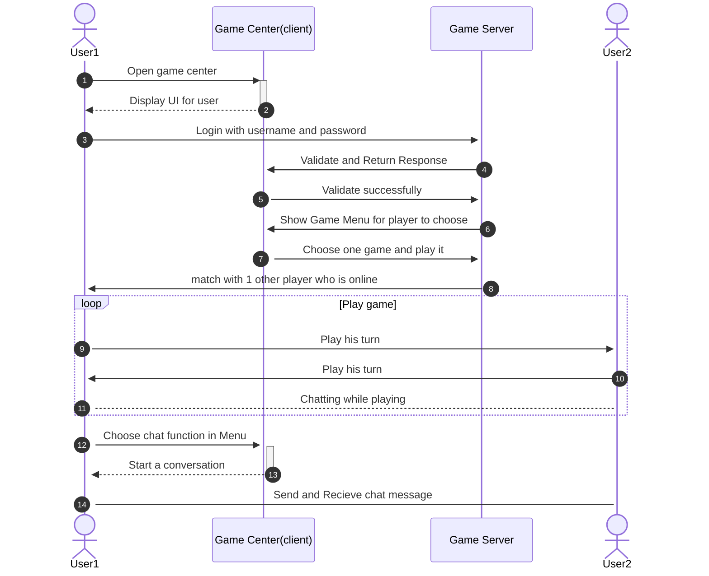

# This is project of Network Programing

## Game Center sequence

```mermaid
sequenceDiagram
autonumber
actor User1
participant gamecenter as Game Center(client)
participant server as Game Server
actor User2

User1->>+gamecenter: Open game center
gamecenter-->>-User1: Display UI for user
User1->>+server:  Login with username and password
server->>+gamecenter:  Validate and Return Response
gamecenter->>+server:  Validate successfully
server->>+gamecenter:  Show Game Menu for player to choose
gamecenter->>+server: Choose one game and play it
server->>+User1: match with 1 other player who is online

loop Play game
User1->>+User2: Play his turn
User2->>+User1: Play his turn
User1-->User2: Chatting while playing
end

User1->>+gamecenter: Choose chat function in Menu
gamecenter-->>-User1: Start a conversation
User1->User2: Send and Recieve chat message
```
